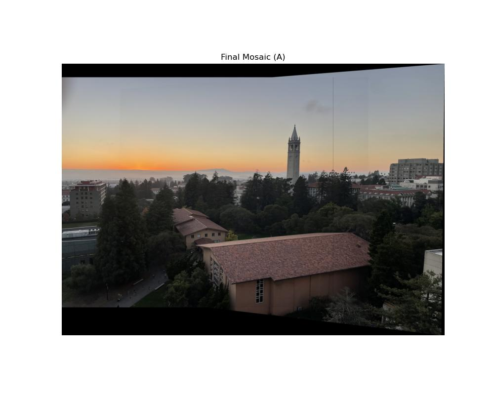
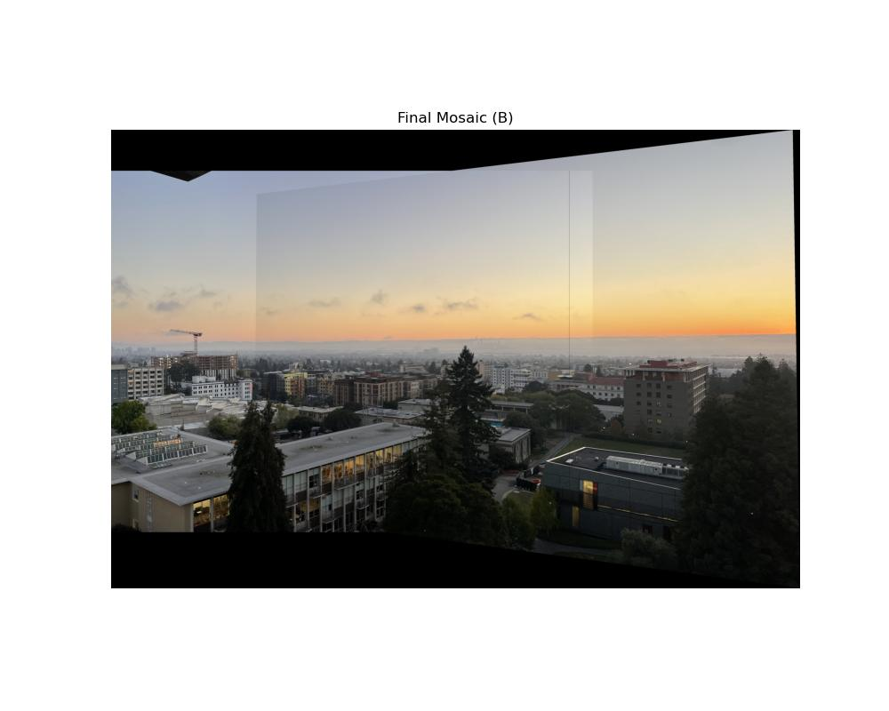
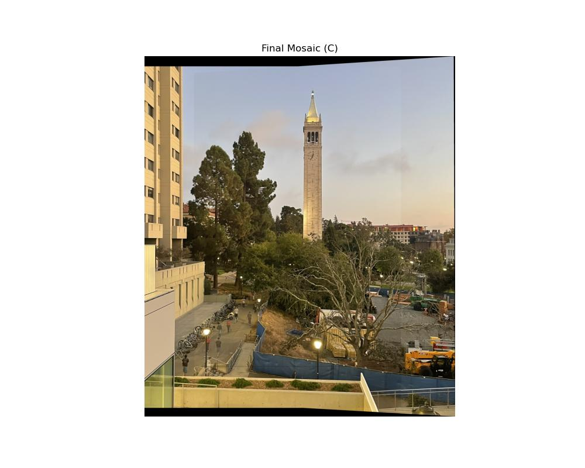

# CS180 Project 3A — Image Mosaicing  
**Author:** Sammie Smith (Fall 2025)  
**Course:** UC Berkeley CS180 – Computer Vision  

---

## Overview

- **Part A2 – Recover Homographies:**  
  Solves the linear system `Ah = b` using Ordinary Least Squares to recover a 3×3 homography matrix for each image pair.  
  📄 [View matrices & vectors](https://docs.google.com/spreadsheets/d/1OH73EVQGJ-F50C0mYkzBH_QPbGQzImOIOkiOC_RHJYE/edit?usp=sharing)

- **Part A3 – Warp Images:**  
  Applies inverse mapping to project images through the recovered homography.  
  Implements both **Nearest Neighbor** (fast) and **Bilinear** (smooth) interpolation.

- **Part A4 – Blend Mosaics:**  
  Warps both images into a shared coordinate frame and merges them with **alpha blending**, weighting image centers more strongly and fading edges for natural transitions.

---

##  Files

```
3/
├── code/
│   ├── recover_homographies.py   # builds A,b and solves Ah=b
│   ├── warp_image.py             # inverse mapping + interpolation
│   ├── make_mosaic.py            # warping + alpha blending
│   ├── plot_correspondences.py   # visualizes matched points
│   ├── harris.py   # provided code to get harris corners
│   ├── anms.py   # get anms corners
│   ├── extract_feature_descriptors.py   # gets feature descriptors
│   ├── feature_matching.py   # matches features using 1,2NN and least squares
│   ├──ransac.py   # ransac algorithm, computes homographies + projects transforms
│   ├── task_B1.py   # generates images for task B1
│   ├── task_B2.py   # generates images for task B2
│   ├── task_B3.py   # generates images for task B3
│   ├── task_B4.py   # generates images for task B4
│   └── __init__.py
├── data/                         # input images + final mosaics
├── index.html                    # full project write-up
└── README.md
```

---

##  Example Results

| Mosaic | Scene | Preview |
|--------|--------|----------|
| A | Campanile at Sunset |  |
| B | Southside at Sunset |  |
| C | View from Grimes |  |

---

**Run:**  
```bash
python code/make_mosaic.py
```
Edit `img_pair_name` ("A", "B", or "C") to generate each mosaic.  

For detailed explanations and results, open **[`index.html`](./index.html)** in your browser.

```bash
python code/task_B1.py # or B2 or B3 or B4
```

**GPT USE**
I used ChatGPT5 to
-  generate plot_correspondences.py. This file plots precomputed correspondences into the input images for debugging
- generate matplotlib plots for visualizing my results. see visualize_matches.py
- generate index.html based off of a google doc i typed up of my results
- generate this README
